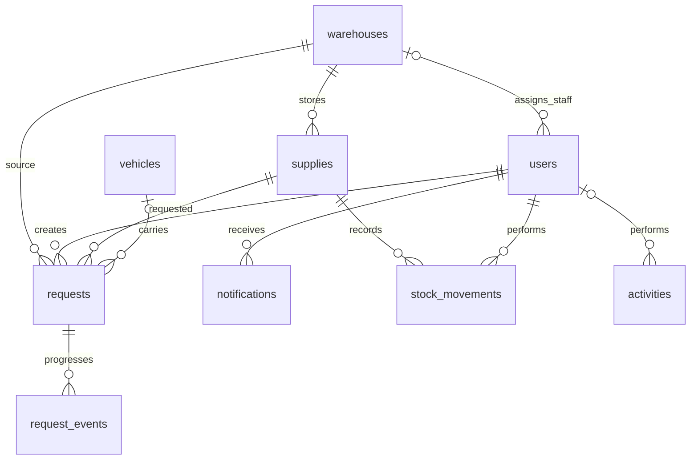

# Military Supply Chain Management System — SupplyLine

A complete college PBL application for a second-year Information Technology student. It tracks fictional everyday supplies from **warehouse → transportation → destination**. It contains no combat, targeting, surveillance, weapons, or classified data.

## 1. Project overview and features

SupplyLine replaces disconnected stock registers with a shared web application. It includes authenticated roles, inventory CRUD, warehouse CRUD, user CRUD, incoming/outgoing stock movements, supply requests, approvals/rejections, vehicle registration/editing and assignment, delivery tracking, alerts, dashboard charts, reports, CSV export, profile and logout.

- **Admin:** all management pages; supply, warehouse and user CRUD; approvals, dispatch, reports.
- **Logistics Officer:** inventory/warehouse viewing, request creation and approval, vehicle management, dispatch, delivery confirmation and reports.
- **Warehouse Staff:** only their assigned warehouse's inventory, incoming/outgoing movements, tracking and alerts. They cannot edit supply definitions, access users, approve requests or dispatch vehicles.

All authorization is enforced by Flask; hiding navigation links alone is not the security mechanism.

## 2. System architecture

```text
Browser: HTML + Bootstrap 5 + custom CSS + JavaScript
                        ↓ HTTP forms / pages
Flask: routes → authentication → role checks → input validation
                        ↓ parameterized SQL / transactions
SQLite: users, warehouses, supplies, requests, vehicles,
        notifications, stock_movements, request_events, activities
                        ↓
Jinja templates render current database records back to the browser
```

There is no paid API or service. Bootstrap is bundled locally, so the application works offline after Python dependencies are installed. Dashboard charts use CSS and HTML instead of a chart service or extra JavaScript library.

## 3. Database and ER description



Each supply belongs to one warehouse. Each request references one supply, its source warehouse and its requesting user. A request receives a vehicle at dispatch; a vehicle can serve many historical requests, but only one active dispatch at a time. Staff users reference their assigned warehouse. Notifications are acknowledged separately for each user. Stock movements record quantity changes, while request events and activities provide a simple audit history. Primary keys identify rows; foreign keys prevent orphan records. SQL CHECK constraints reject negative stock and invalid statuses.

`schema.sql` contains the complete table definitions. Extra fields on requests preserve dispatch, expected and delivered dates even after vehicles are reused. All example locations and people are fictional demo records.

## 4. Folder structure and important files

```text
military_supply_chain/
├── app.py                 # Flask routes, authorization, validation and transactions
├── schema.sql             # SQLite tables, constraints and indexes
├── database.db            # Seeded local database (generated, ignored by Git)
├── requirements.txt       # Flask dependency
├── test_app.py            # Integration tests against temporary databases
├── README.md              # Setup, architecture and demonstration guide
├── PBL_REPORT.md          # Problem statement, objectives and viva answers
├── templates/
│   ├── base.html          # Shared navigation, header, flash messages and footer
│   ├── macros.html        # Reusable form fields, status labels and headings
│   ├── login.html
│   ├── dashboard.html
│   ├── inventory.html
│   ├── add_supply.html
│   ├── edit_supply.html
│   ├── warehouses.html
│   ├── requests.html
│   ├── approvals.html
│   ├── transportation.html
│   ├── tracking.html
│   ├── alerts.html
│   ├── reports.html
│   ├── users.html
│   ├── profile.html
│   └── error.html
└── static/
    ├── css/style.css      # Responsive navy, blue and white layout
    ├── js/script.js       # Mobile navigation and delete confirmations
    └── vendor/bootstrap.min.css # Bootstrap 5.3.3 (MIT license in file header)
```

`app.py` keeps the backend in one file for easy classroom study. The `db()` helper opens a SQLite connection for the current request. `roles()` is a decorator that checks login and role before a route executes. `number()`, `text()`, `choice()` and `iso_date()` validate form inputs. `with db():` commits related changes together or rolls them back on error. Templates extend `base.html`, so changing the sidebar changes every page. `schema.sql` is separate so the data model can be studied without reading route code.

## 5. Installation requirements

- Python 3.10 or newer, with pip and venv.
- Any current browser; macOS, Windows or Linux.
- Internet for the initial Python package installation only.
- SQLite is included with Python; no separate database server is needed.

## 6. Exact setup commands

The project folder and files have already been created in this workspace. To create a destination folder on another computer, run `mkdir military_supply_chain` and copy the source files into it.

### macOS / Linux

```bash
cd "/Users/nileshsmac/Documents/Military Supply Chain Management System/military_supply_chain"
python3 -m venv .venv
source .venv/bin/activate
python -m pip install -r requirements.txt
python -m flask --app app init-db
python -m flask --app app run --host 127.0.0.1 --port 5000
```

On another computer, replace the first path with the folder containing `app.py`.

### Windows PowerShell

```powershell
cd "C:\path\to\military_supply_chain"
py -m venv .venv
.venv\Scripts\python.exe -m pip install -r requirements.txt
.venv\Scripts\python.exe -m flask --app app init-db
.venv\Scripts\python.exe -m flask --app app run --host 127.0.0.1 --port 5000
```

Open **http://127.0.0.1:5000** in your browser. Stop the server with Ctrl+C. If port 5000 is occupied, use `--port 5001` and open the corresponding URL. The `init-db` command creates `database.db` and fictional sample records only when users do not already exist; rerunning it preserves data.

### Demo credentials

| Role | Email | Password |
|---|---|---|
| Admin | admin@demo.local | Demo@12345 |
| Logistics Officer | officer@demo.local | Demo@12345 |
| Warehouse Staff | staff@demo.local | Demo@12345 |

The staff account is assigned to Central Supply Depot. Sign out before switching roles.

## 7. Demonstration walkthrough

1. Sign in as Admin. Show the six summary cards, three charts, recent requests, alerts and activities.
2. Open Inventory and add a fictional supply. Edit it, then record incoming stock. Set its minimum above its quantity to trigger **LOW STOCK ALERT**.
3. Choose an expiry date within 30 days to trigger **EXPIRY ALERT**. Past dates display an expired alert and cannot be dispatched.
4. Open Warehouses. Show computed current stock, capacity, manager and contact details.
5. Create a request for a supply with sufficient stock, using a fictional destination.
6. Open Approvals and approve it. Approval checks availability but does not reserve or deduct stock.
7. Open Supply requests. Expand **Assign & dispatch**, select an available vehicle and a future expected delivery date, then dispatch.
8. Verify the inventory decreased exactly once and the vehicle is in transit. View the five delivery milestones.
9. Click **Mark delivered**. The request keeps its delivery history; the vehicle becomes available again.
10. Use Reports to filter by warehouse, category, request date or status, then export CSV.
11. Sign in as Warehouse Staff and demonstrate that only the assigned warehouse is visible and management URLs return a forbidden page.

## 8. Business rules and security

- Passwords are hashed with Werkzeug; passwords are never stored as readable strings.
- Sessions are signed, HttpOnly and SameSite=Lax, with a four-hour lifetime. A random secret is generated locally in `.session-secret`; an environment `SECRET_KEY` can override it.
- Every POST form carries a CSRF token. Logout uses POST.
- SQL uses bound parameters; templates automatically escape user text. CSV text is protected against spreadsheet formula injection.
- Warehouse staff scope is checked in backend queries and stock operations.
- Stock cannot become negative or exceed warehouse capacity. Dispatch checks supply activity, expiry, warehouse activity, vehicle availability and quantity under a write transaction.
- Allowed transitions: Pending → Approved or Rejected; Approved → In Transit; In Transit → Delivered. The tracker marks Dispatched and In Transit at the same dispatch event; these are not separate editable database statuses.
- Deleting records with request/audit history is blocked to preserve relationships. Supplies with history can be marked inactive.
- Alerts are calculated from current records; acknowledgements persist per user. Resolved conditions disappear from the active alert list. Expiry means within 30 days; overdue means an in-transit request whose expected date is earlier than today.

## 9. Reports and educational simplifications

Current inventory and warehouse totals are snapshots, not historical balances. Date filters apply to request creation dates. Active/Inactive filters match supply records; request statuses match requests. Vehicle availability is a separately labeled, unfiltered summary. CSV exports matching inventory and request rows. Stock quantities retain their original units; warehouse capacity and aggregate chart totals use a simple combined item-count model for this PBL, not physical volume or weight.

Each supply row represents one item/batch at one warehouse. This version has no reservation queue, multi-item requests, partial deliveries, destination warehouse receipt, GPS routes, email notifications, login rate limiting, or production deployment setup. Destination receipt is represented by delivery confirmation, not a second inventory addition. SQLite serializes writes, which is appropriate for a small demonstration. The Flask development server is used locally.

## 10. Tests

From the project directory:

```bash
python -m unittest -v test_app.py
```

The integration suite creates a separate temporary database for every test and checks all pages, role restrictions, CSRF rejection, CRUD, low-stock and expiry alerts, repeat initialization, password hashing/change, the dispatch/delivery lifecycle, repeated dispatch protection and rollback when stock is insufficient. It does not change your demo database.

Read `PBL_REPORT.md` for the submission narrative and viva preparation.
# military-supply-chain-management
